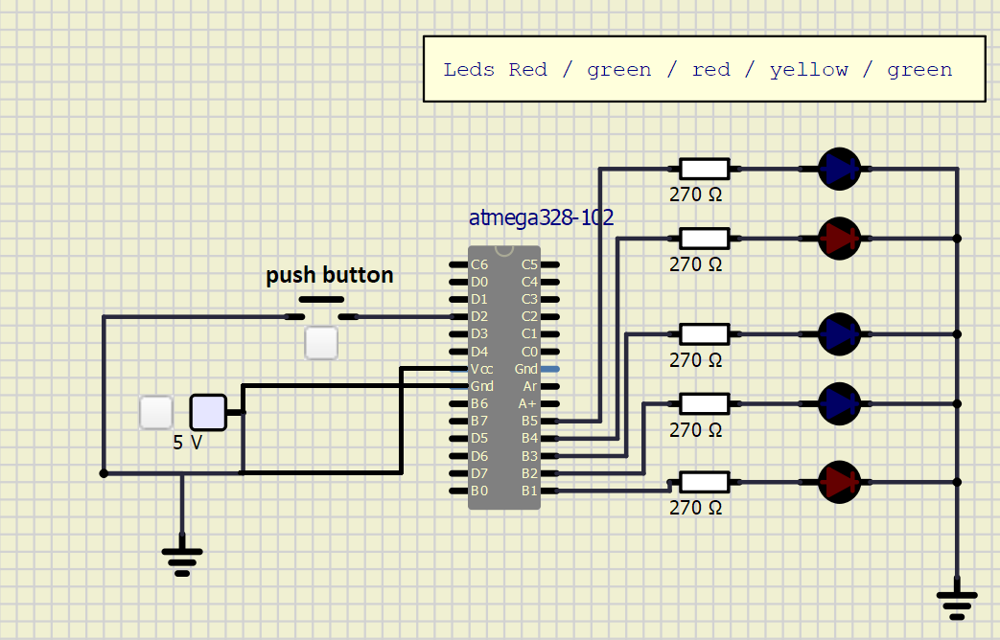

# Lab 2: MEHDI BENNANI

### GPIO control registers

1. Complete the table for DDRB and PORTB control register values.

   | **DDRB** | **PORTB** | **Direction** | **Internal pull-up resistor** | **Description** |
   | :-: | :-: | :-: | :-: | :-- |
   | 0 | 0 | input | no | Tri-state, high-impedance |
   | 0 | 1 | input | yes | pull-up |
   | 1 | 0 | output | no | low output|
   | 1 | 1 | output | no | high output|

### GPIO library

2. Complete the table with code sizes from three versions of the blink application.

   | **Version** | **Size [B]** |
   | :-- | :-: |
   | Arduino-style     | 478 |
   | Registers         | 188 |
   | Library functions | 188 |

### Traffic light

3. Scheme of traffic light application with one red/yellow/green light for cars, one red/green light for pedestrians, and one push button. Connect AVR device, LEDs, resistors, push button (for pedestrians), and supply voltage. The image can be drawn on a computer or by hand. Always name all components and their values!

   